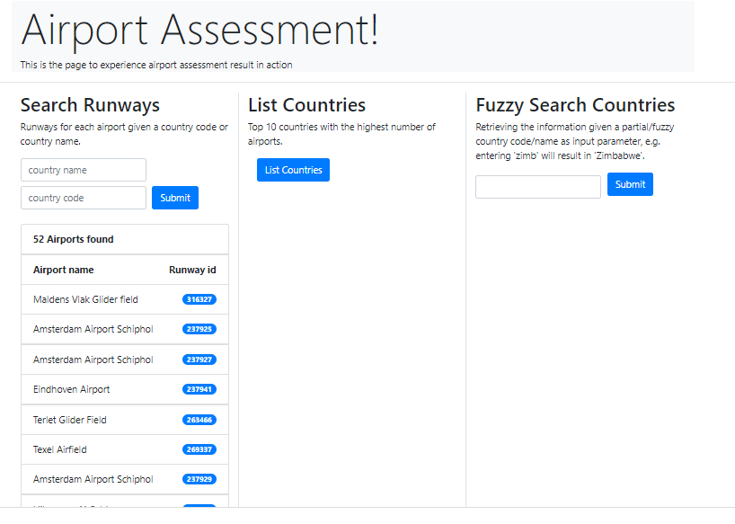
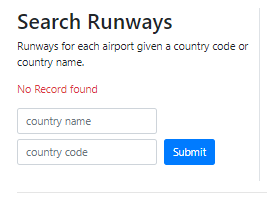

# AIRPORT ASSESSMENT
Airport Assessment using java, springboot, maven, h2 database to search airport, find runways for each airport by country and top 10 countries with highest number of airports.

# Introduction
This is the project to search airport, find runways for each airport by country and top 10 countries with the highest number of airports, and to find different countries.
When we run the application home page will open, where we can perform different search operations.
# Technology & Version used
#### JAVA1.8
    Download java1.8 openJDK
    extract zip or install if its .exe file
    add JAVA_HOME in system variable
    add Path in environment variable 
    verify java: open command prompt and execute java -version
#### Maven 3.8.6
    Download maven from https://maven.apache.org/download.cgi 
    Extract folder
    Add MAVEN_HOME in system variable
    Add Maven Path in environment variable
    verify maven: open command prompt and execute mvn -version    

#### Springboot 2.6.13
#### H2 database 2.1.214
#### Hibernate 5.11.11.Final
#### openCsv, CSS, Freemarker
### How to run locally
To build project:

    mvn clean install

Then to run the project:

    java -jar /target/airport-0.0.1.jar
    or
    mvn sring-boot:run

### Result page screenshots
##### Home Page

##### When click on List Countries button it shows top 10 countries with the highest number of airports

##### Fuzzy Search

##### Search for airports based on country code or name 

##### If we pass wrong values 

